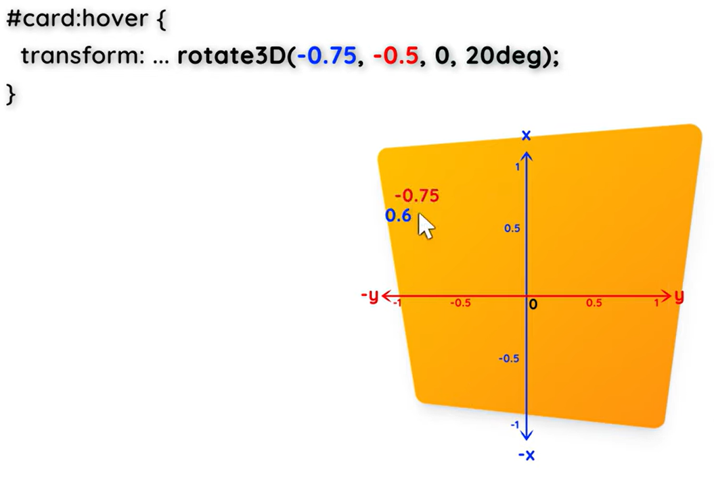
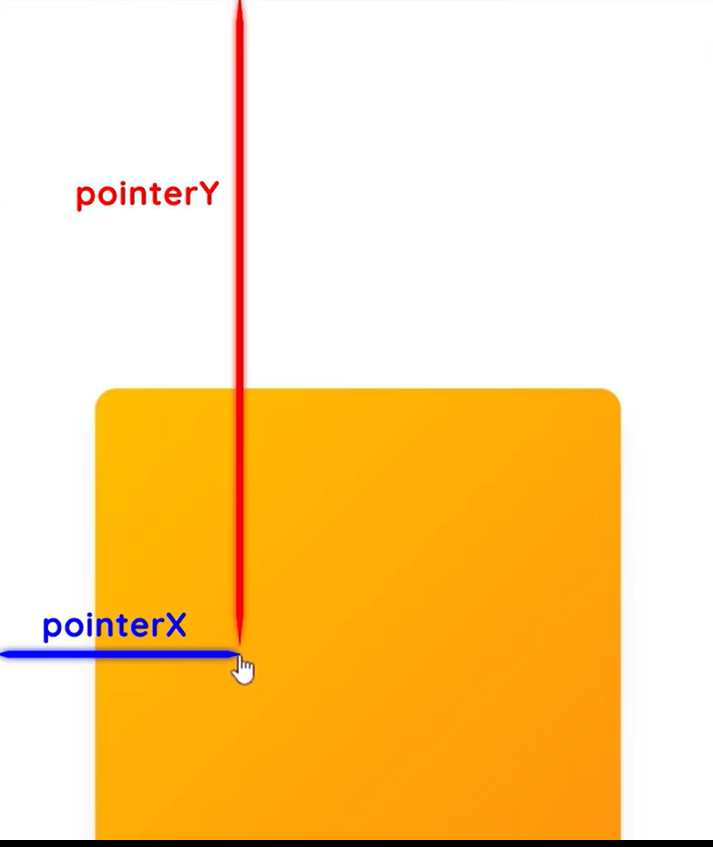
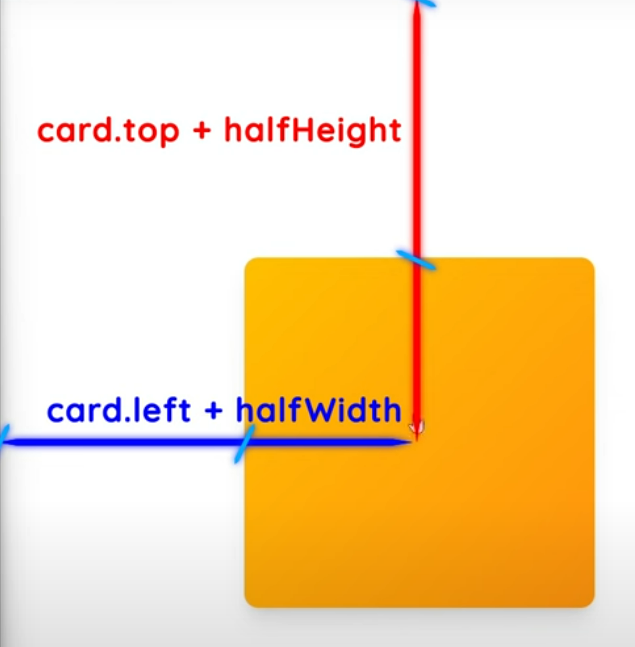

## Tilting on hover effect
___

#### Rotate3D property explanation - [text](https://youtu.be/zAxXE9vZWPo?t=177)

### clientX and clientY properties define the coordinates of the mouse pointer, relative to the browser's visible viewport

### getBoundingClientRect method return an object of card(in this case) properties, like width and height, top and left, which we need for futher calculations

### Centar of the card

