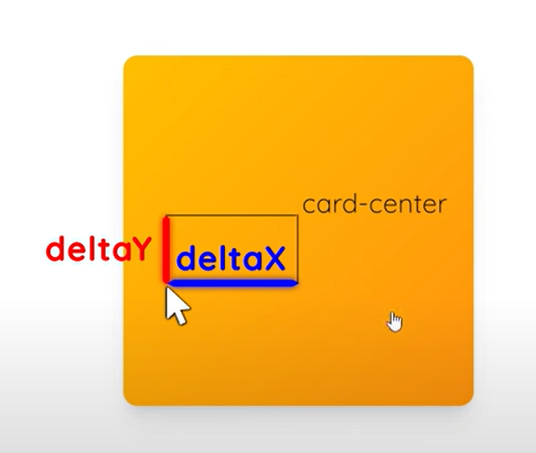
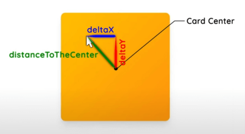

## Tilting on hover effect
___

#### Rotate3D property explanation - [watch explanation](https://youtu.be/zAxXE9vZWPo?t=177)

#### clientX and clientY properties define the coordinates of the mouse pointer, relative to the browser's visible viewport

#### getBoundingClientRect method return an object of card(in this case) properties, like width and height, top and left, which we need for futher calculations

#### Centar of the card

#### calculating the mouse cursor coordinates relative to the card center in deltaX and deltaY

#### calculating the distance on the mouse cursor from the center of the card to have different tilting angle based on distance from the center
